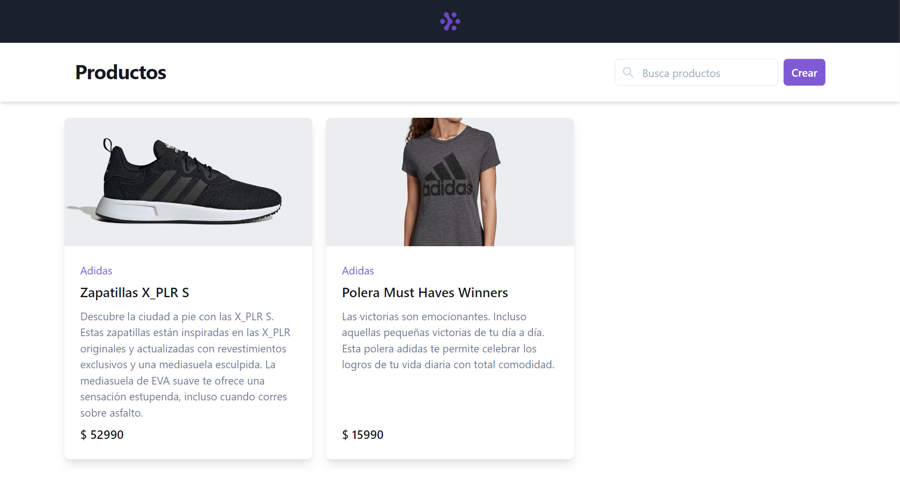

# Awesome store app

Frontend application using React and Typescript for a fictional store of products.



## Functionalities

- Create product with images
- Update product
- List products
- Delete a product
- Search products by brand, productId, name or description.
- _Easter egg_: If you enter a palindrome in the search bar, the products will have a 20% off.
- Mobile friendly
- A 200 ms delay was manually added for the requests to get all products and to get a single product. This was done to avoid a flashing loading spinner.

## Technologies

- Chakra UI as a component library
- Typescript
- React
- React Query for server state and cache management
- React Hook Form for form state handling
- Axios for data fetching

## Installation

Clone this repo, then run:

```
yarn install
```

## Running

First, make sure you have the backend API running on port `4200`. Then run:

```
yarn start
```

## TODO

- [ ] End to end and/or integration tests with Cypress
- [ ] Eslint + prettier setup for React + Typescript
- [ ] Currency formatting with `currency.js`
- [ ] CI with Github actions to run Cypress and Eslint.
